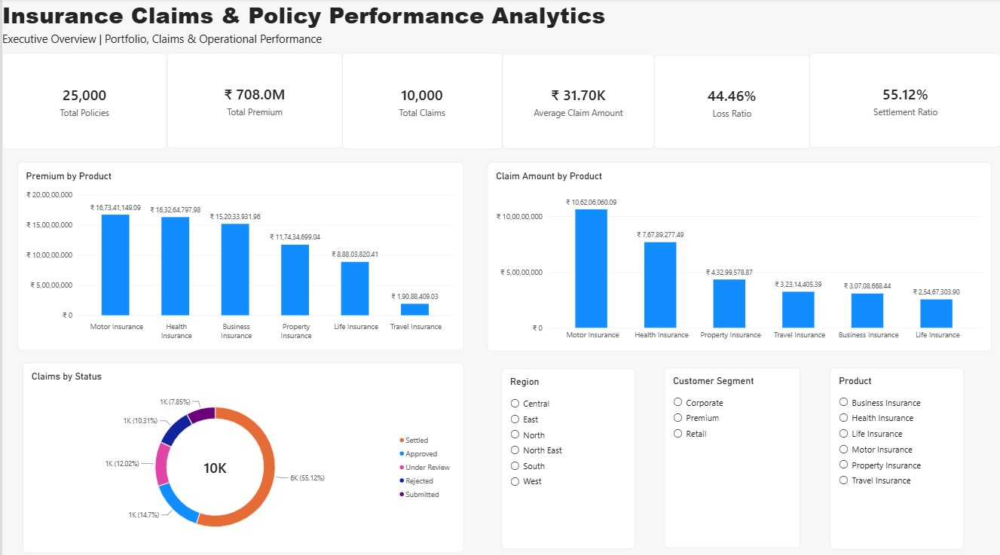
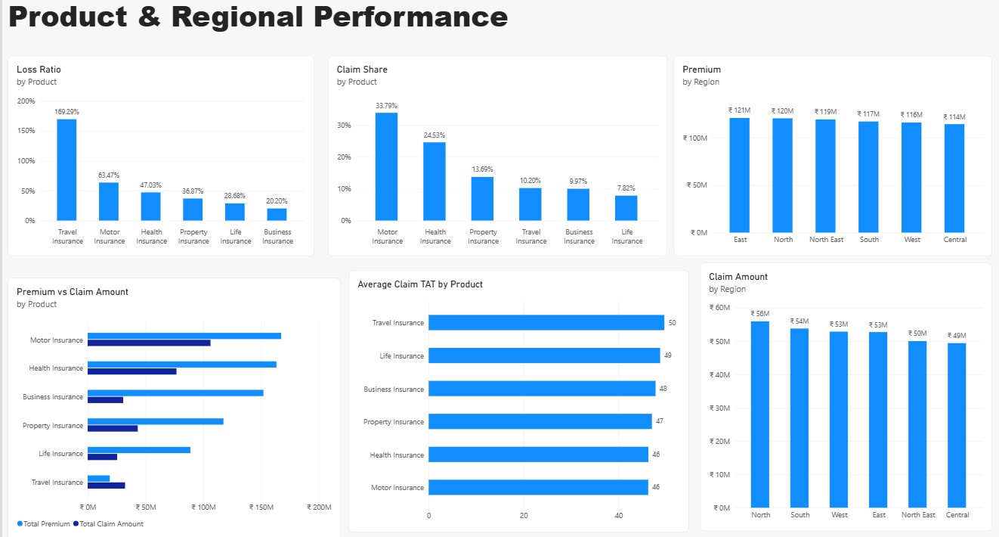
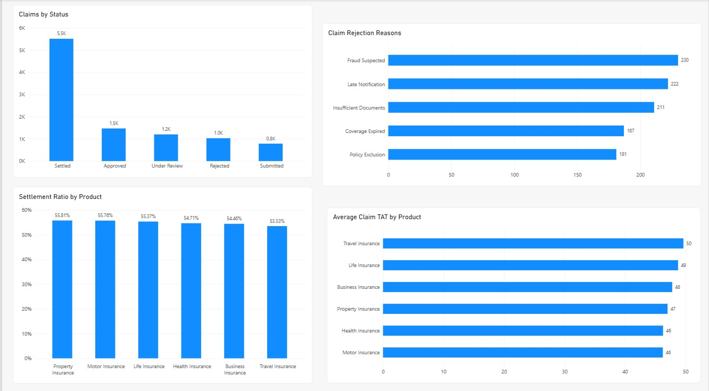
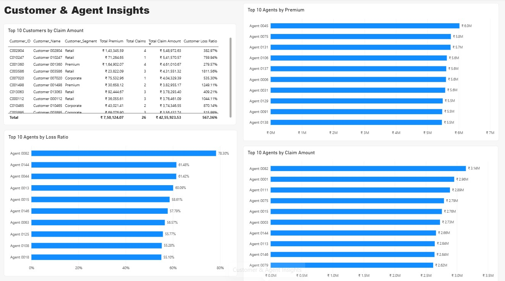
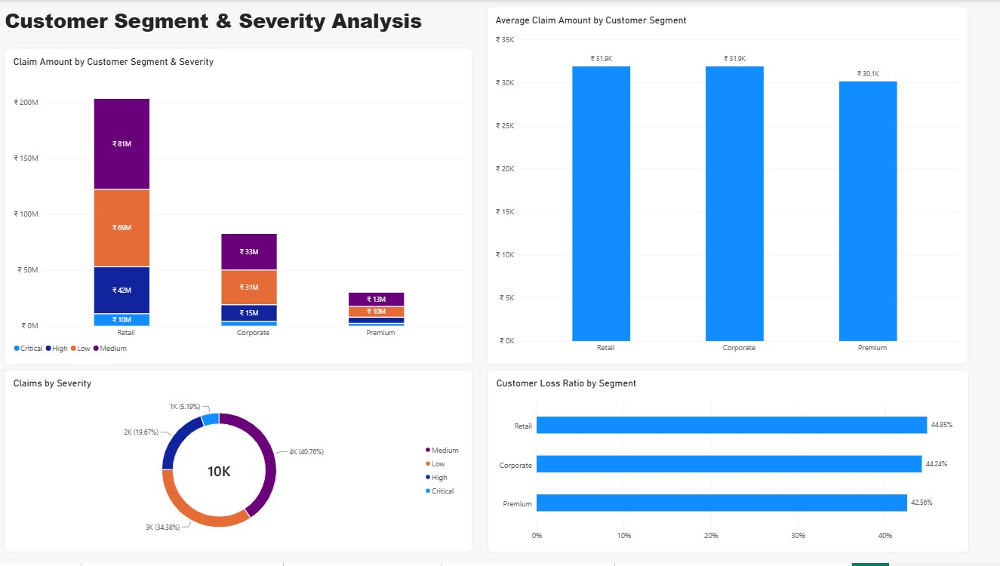

# Insurance Claims & Policy Performance Analytics

## 📌 Project Overview

Performed insurance claims and policy performance analysis using **Power BI** to understand portfolio performance, claim behavior, customer risk, agent performance, product profitability, and regional trends.

The project analyzes **25K+ insurance policies and 10K+ claims** and converts the data into an interactive **5-page Power BI dashboard** designed to support business decision-making.

---

## 🎯 Business Problem

Insurance companies need to monitor policy performance, claims, customer risk, agent effectiveness, and regional performance to maintain a profitable portfolio.

However, analyzing these areas independently makes it difficult to identify:

- High-loss insurance products
- High-risk customers
- Agents associated with higher claim losses
- Regional claim concentration
- Customer segments with higher claim severity
- Major claim rejection reasons
- Differences between premium generated and claims incurred

This project addresses these challenges by consolidating policy, customer, claim, agent, product, region, and claim payment data into a single analytical dashboard.

---

## 📊 Dashboard Preview

### Page 1 — Executive Overview

Provides a high-level view of the insurance portfolio, including total policies, premium, claims, average claim amount, loss ratio, and settlement ratio.



---

### Page 2 — Product & Regional Performance

Analyzes loss ratio, claim frequency, premium, claim amount, claim TAT, and regional performance across insurance products and regions.



---

### Page 3 — Claims & Customer Risk

Focuses on claim status, rejection reasons, settlement performance, and average claim turnaround time.



---

### Page 4 — Customer & Agent Insights

Identifies high-value customers and agents based on premium, claim amount, and loss ratio.



---

### Page 5 — Customer Segment & Severity Analysis

Analyzes claim amounts and claim severity across customer segments and identifies differences in average claim amount and customer loss ratio.



---

## 🛠️ Tools & Technologies

- **Power BI**
  - Data Modeling
  - Power Query
  - DAX
  - Interactive Visualizations
  - Slicers & Filters
- **SQL**
  - Data validation
  - Aggregations
  - Relationship validation
  - Data quality checks
- **Excel / CSV**
  - Source datasets
  - Data inspection and validation

---

## 📂 Dataset

The project uses multiple related datasets covering the insurance business process:

| Dataset | Approx. Records | Purpose |
|---|---:|---|
| Customers | 15K+ | Customer demographics and segmentation |
| Policies | 25K+ | Policy, premium and renewal information |
| Claims | 10K+ | Claim amount, status, severity and TAT |
| Claim Payments | 7K+ | Claim payment transactions |
| Products | 7 | Insurance product information |
| Agents | 150+ | Agent and experience information |
| Regions | 7 | Regional information |

---

## 🔗 Data Model

The Power BI model follows a relational structure connecting the major business entities.

### Key Relationships

- Policies → Customers
- Policies → Products
- Policies → Agents
- Policies → Regions
- Claims → Policies
- Claim Payments → Claims

The relationships were validated to ensure that the analytical model provides consistent results across customers, policies, claims, agents, products, and regions.

---

## 📈 Key Metrics

The dashboard includes the following business metrics:

- Total Policies
- Total Premium
- Total Claims
- Total Claim Amount
- Total Approved Amount
- Average Claim Amount
- Average Claim TAT
- Loss Ratio
- Customer Loss Ratio
- Agent Loss Ratio
- Claim Frequency %
- Settlement Ratio
- Renewal Rate
- Cancellation Rate

### Key KPI Results

- **25,000 Policies**
- **₹708M Total Premium**
- **10,000 Claims**
- **₹31.7K Average Claim Amount**
- **44.46% Loss Ratio**
- **55.12% Settlement Ratio**

---

## 🔍 Key Analysis

### 1. Product Performance

Analyzed:

- Premium generated by product
- Claim amount by product
- Loss ratio by product
- Claim frequency by product
- Average claim TAT

### 2. Regional Performance

Analyzed:

- Premium by region
- Claim amount by region
- Regional contribution to portfolio performance

### 3. Claims Analysis

Analyzed:

- Claims by status
- Settlement ratio
- Claim rejection reasons
- Average claim turnaround time
- Claim severity distribution

### 4. Customer Risk Analysis

Analyzed:

- Top customers by claim amount
- Customer loss ratio
- Customer segment performance
- Average claim amount by customer segment

### 5. Agent Performance

Analyzed:

- Top agents by premium
- Top agents by claim amount
- Top agents by loss ratio

---

## 💡 Key Insights

- **Travel Insurance recorded the highest loss ratio at approximately 169%, indicating significant claims exposure relative to premium generated.**

- **Motor Insurance had the highest claim frequency at approximately 33.8%, making it an important product for claims monitoring.**

- **East region generated the highest premium at approximately ₹121M, while North region recorded the highest claim amount at approximately ₹56M.**

- **Retail customers contributed the highest overall claim amount, indicating significant claims exposure within this customer segment.**

- **Corporate customers had the highest average claim amount at approximately ₹31.9K, closely followed by Retail customers.**

- **Agent 0082 had the highest agent-level loss ratio at approximately 78.3%, indicating a need for further investigation of the claims generated through this agent.**

- **Settled claims represented approximately 55% of total claims, indicating that more than half of the recorded claims reached settlement status.**

- **Fraud Suspected was the most common recorded claim rejection reason, followed by Late Notification and Insufficient Documents.**

---

## 📌 Business Recommendations

### Product Management
- Review pricing and underwriting strategies for products with high loss ratios.
- Closely monitor Travel Insurance due to its significantly high loss ratio.
- Investigate products where claim frequency and claim severity are both elevated.

### Claims Management
- Investigate major claim rejection reasons such as suspected fraud and late notification.
- Improve document verification and claim intake processes.
- Monitor claim turnaround time to improve customer experience.

### Agent Management
- Conduct periodic performance reviews for agents with unusually high loss ratios.
- Investigate claim patterns associated with high-loss agents.
- Use loss ratio alongside premium and claim volume when evaluating agent performance.

### Customer Management
- Identify high-risk customer segments based on claim frequency, claim severity, and loss ratio.
- Develop targeted risk-management strategies for customers with repeated or high-value claims.

### Regional Management
- Monitor regions with high claim amounts relative to premium.
- Use regional loss trends to support underwriting and portfolio allocation decisions.

---

## 📊 Dashboard Features

- Executive KPI Cards
- Product Performance Analysis
- Regional Performance Analysis
- Claims Status Analysis
- Claim Rejection Reason Analysis
- Customer Risk Analysis
- Agent Performance Analysis
- Customer Segment Analysis
- Claim Severity Analysis
- Interactive Region Slicer
- Customer Segment Slicer
- Product Slicer
- Cross-filtering across dashboard visuals

---

## 🧮 DAX Measures

Key DAX measures used in the project include:

```DAX
Total Policies =
COUNTROWS(Policies)

Total Premium =
SUM(Policies[Premium_Amount])

Total Claims =
COUNTROWS(Claims)

Total Claim Amount =
SUM(Claims[Claim_Amount])

Total Approved Amount =
SUM(Claims[Approved_Amount])

Average Claim Amount =
AVERAGE(Claims[Claim_Amount])

Average Claim TAT =
AVERAGE(Claims[Claim_TAT_Days])

Loss Ratio =
DIVIDE(
    [Total Claim Amount],
    [Total Premium],
    0
)

Settlement Ratio =
DIVIDE(
    CALCULATE(
        [Total Claims],
        Claims[Claim_Status] = "Settled"
    ),
    [Total Claims],
    0
)

Renewal Rate =
DIVIDE(
    CALCULATE(
        [Total Policies],
        Policies[Renewal_Status] = "Renewed"
    ),
    [Total Policies],
    0
)

Cancellation Rate =
DIVIDE(
    CALCULATE(
        [Total Policies],
        Policies[Policy_Status] = "Cancelled"
    ),
    [Total Policies],
    0
)

✅ Data Quality & Validation

Data quality checks were performed across the major relationships in the model.

Validated relationships include:

Policies → Customers
Policies → Products
Policies → Agents
Claims → Policies
Claims → Customers
Claims → Agents
Claims → Regions
Claims → Products

All relationship validation checks returned 0 missing references.

Additional data quality issues such as missing values, duplicate customer IDs, negative premium amounts, and missing claim amounts were identified during data preparation and validation.

🏁 Conclusion

The Insurance Claims & Policy Performance Analytics project provides an end-to-end view of insurance portfolio performance using Power BI.

The dashboard combines policy, premium, claims, customer, agent, product, and regional data to identify profitability risks, high-value claims, high-risk customers, agent-level loss patterns, and product performance issues.

The analysis can support insurance teams in making better decisions around underwriting, claims management, customer risk management, agent monitoring, and portfolio optimization.

👤 Skills Demonstrated

Power BI | DAX | Power Query | Data Modeling | SQL | Data Validation | Data Visualization | Business Analysis | KPI Development | Insurance Analytic
